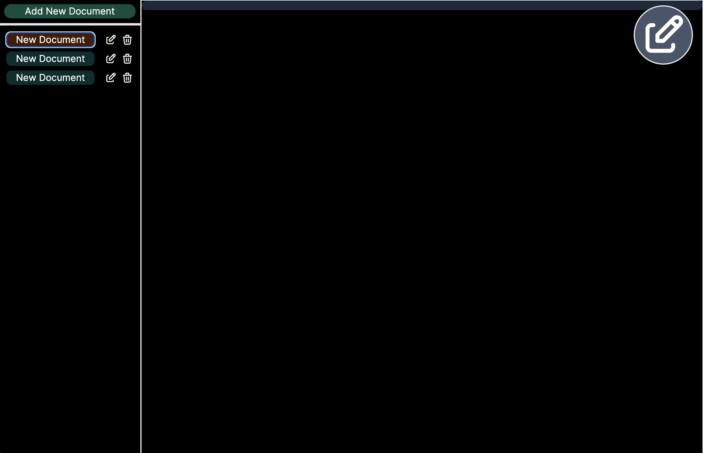
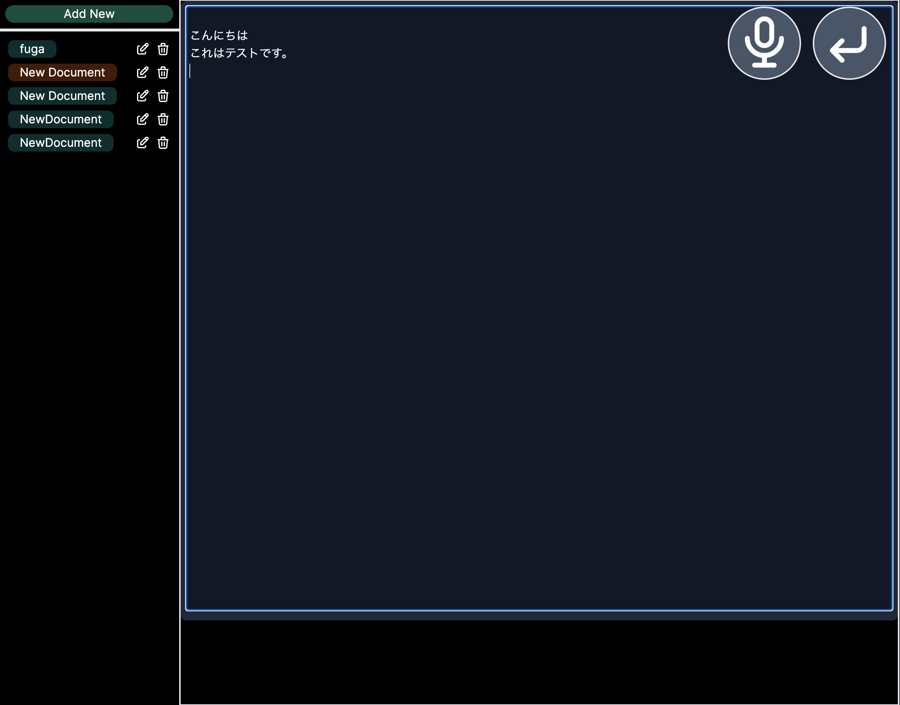

# MD Wiki

- コンセプト：誰でも使えるMarkdown Wiki
- データは、ブラウザのローカルストレージに保存されるため、プライベートに利用できる

## スクリーンショット

### ドキュメント保存・削除対応

### 音声入力機能対応

## Demo

* https://mdwiki-six.vercel.app/

## 音声入力のための準備

* 環境変数 NEXT_PUBLIC_OPENAI_APIKEY に、OpenAIのAPIキーを設定すること
